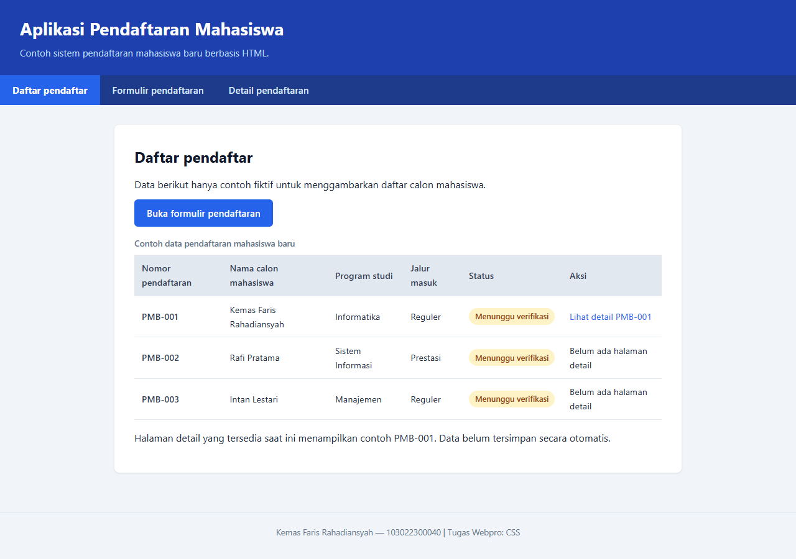
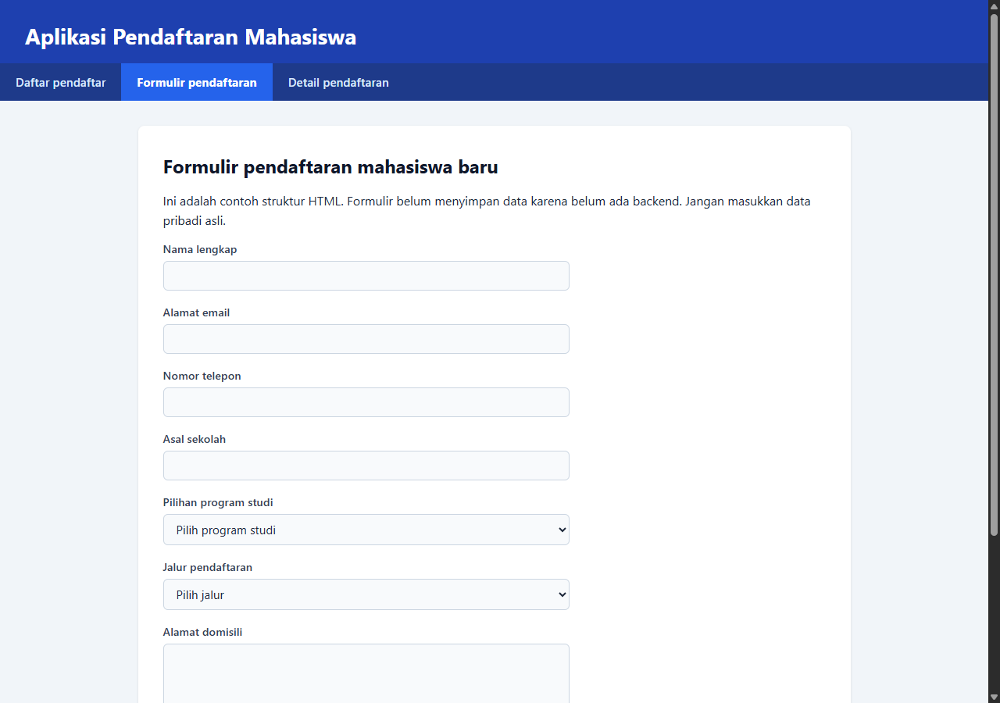
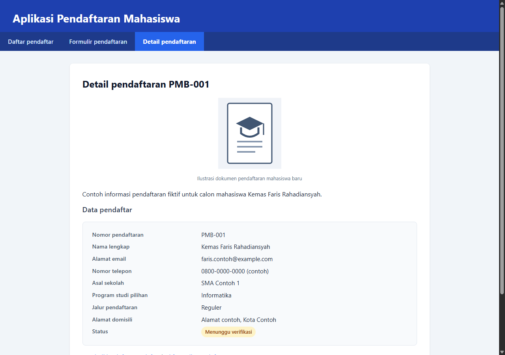
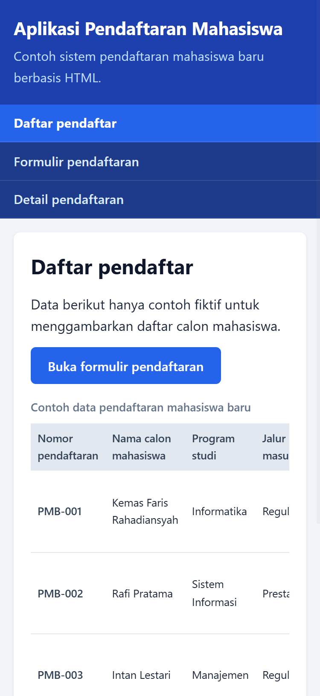
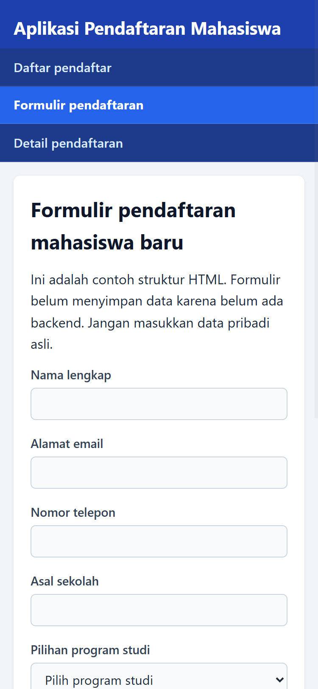
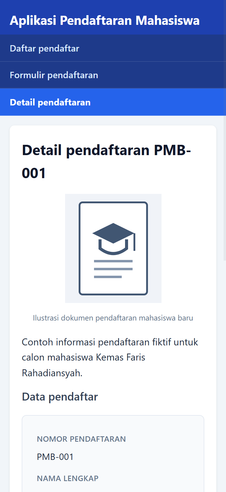

# Aplikasi Pendaftaran Mahasiswa — Tugas 3: CSS

**Kemas Faris Rahadiansyah — 103022300040**

## Deskripsi

Melanjutkan struktur HTML dari Tugas 2, tugas ini menerapkan **CSS native** (tanpa framework) untuk mempercantik tampilan aplikasi pendaftaran mahasiswa.

## Halaman

| File | Keterangan |
|------|-----------|
| `index.html` | Daftar pendaftar (tabel data mahasiswa) |
| `pendaftaran.html` | Formulir pendaftaran mahasiswa baru |
| `detail-pendaftaran.html` | Detail pendaftaran PMB-001 |
| `style.css` | External stylesheet (digunakan di semua halaman) |

## Fitur CSS yang Diterapkan

1. **Font properties** — `font-family` (Segoe UI), `font-size`, `font-weight` konsisten di semua halaman.
2. **Styling list (ul)** — Navigasi utama menggunakan `<ul>` yang di-styling horizontal dengan flexbox.
3. **Text alignment** — `text-align` pada judul header, caption tabel, footer, dan figcaption.
4. **Warna konsisten** — Skema warna biru (#1e40af, #2563eb) sebagai identitas visual; background abu terang (#f1f5f9) dan kartu putih.
5. **Penggunaan `
` dan ``**:
   - `
` — mengelompokkan judul dan subtitle header
   - `
` — wrapper tabel agar bisa scroll horizontal
   - `
` — mengelompokkan label dan input form
   - `
` — kartu untuk menampilkan data detail
   - `` — badge status pendaftaran
6. **Responsive @media query** — Pada layar ≤640px:
   - Navigasi berubah dari **horizontal ke vertikal**
   - Definition list menjadi single-column
   - Tombol form menjadi full-width

## Screenshot

### Desktop

### Mobile

